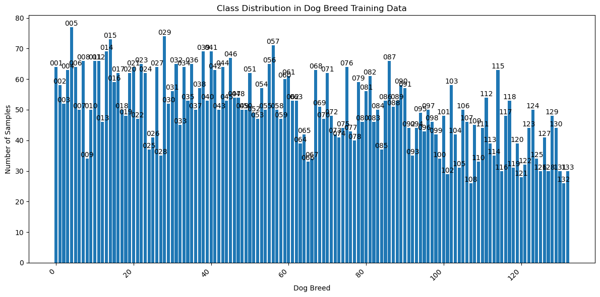
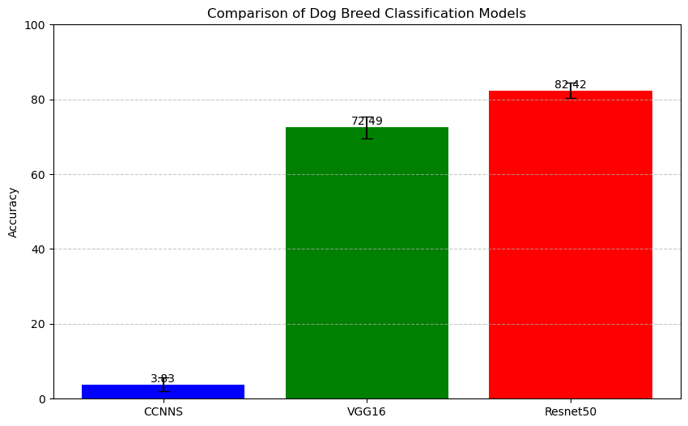

# A Journey into Dog Breed Classification with Deep Learning

Original blog post: <https://blog.anibalhsanchez.com/en/blogging/89-a-journey-into-dog-breed-classification-with-deep-learning.html>

When I first embarked on my [Udemy Data Scientist Nanodegree](https://www.udacity.com/enrollment/nd025) Program, I never anticipated it would lead me to create an algorithm capable of recognizing dog breeds from images. Coming from a background in writing a thesis on *Particle Imaging and Tracking in Branched Electrochemical Systems*, this project reconnected me with the fascinating field of image processing.

## What the Algorithm Does - Project Highlights

The system goes beyond a simple breed classifier. The detection and recognition algorithm can:

1. Detect if an image contains a dog or a human with a high level of accuracy
2. Predict the specific dog breed

## High-level Overview

Classifying dog breeds is a complex task due to several factors. Some breeds look incredibly similar, and color variations within a breed can be dramatic. Randomly guessing the dog breed would yield less than 1% accuracy.

The final project aims to develop an algorithm to detect whether an image contains a dog or a human and then predict the dog breed. The detection is based on Convolutional Neural Networks (CNNs).

The analysis tested different CNNs to evaluate the dog breed detection algorithm based on the result's accuracy.

The expected solution was an algorithm that could:

1. Accurately detect dogs and humans in images
2. Classify dog breeds with high accuracy and suggest a resembling dog breed
3. If not, confirm if the human contains a human or not (neither case)

### Strategy for Solving the Problem

The strategy involved a multi-step approach to evaluate different techniques and results:

- **Human Detection**: Using OpenCV's Haar cascade classifier
- **Dog Detection**:
  - Using a pre-trained ResNet50 model
  - Creating a Convolutional Neural Network (CNN) from scratch
  - Using Transfer Learning with ResNet50 to enhance performance

## Description of Input Data

The input data consisted of:

1. A dataset of dog images, categorized by breed (sampleImages folder, udacity-aind/dog-project/dogImages.zip)
2. A dataset of human frontal face images categorized by public figure (lfw folder, udacity-aind/dog-project/lfw.zip)
3. Test images for general evaluation (from Wikimedia Commons).

### Exploratory Data Analysis

1. **Dog Images Dataset**: Contains 8,351 images of 133 dog breeds, separated into test, training, and validation sets.
2. **Human Images Dataset**: Contains 13,233 images of 5,749 public figures.
3. **Sample Images**: Contains 20 sample images for initial tests.

#### Class Distribution in Dog Breed Training Data

The bar chart visualizes the distribution of images across the 133 dog breeds in the dataset. There is a notable imbalance, with an average of 50 images per breed, ranging from 26 to 77. This disparity could lead to biased results, as the model may perform better on breeds with more representation and struggle with those with fewer images.

The dataset's size, averaging 50 images per breed, is relatively small for CNN training. This limitation could hinder the model's ability to generalize effectively across all breeds. Particularly concerning are the breeds with only 26 images, which may need better classification performance due to underrepresentation.

Addressing the class imbalance is crucial for achieving reliable results. Strategies like oversampling underrepresented breeds or using weighted loss functions during training could help balance the model's performance. Additionally, ensuring diverse images within each breed category would further enhance the model's ability to recognize various dog appearances and poses.

While data augmentation techniques could help mitigate these issues, the ideal solution would be significantly increasing the dataset size. Aiming for 500-1000 images per breed would provide a more robust foundation for training. This tenfold increase would allow CNN to learn more comprehensive features and improve its generalization capabilities across all breeds.

### Data Preprocessing

Preprocessing steps included:

1. Resizing images to 224x224 pixels
2. Normalizing pixel values
3. Extracting bottleneck features from pre-trained models

## Modeling

The modeling process involved:

1. Using VGG16 and ResNet50 CNNs
2. Creating a basic CNN from scratch
3. Implementing transfer learning in the ResNet50 model
4. Fine-tuning models for dog breed classification

## Metrics

The metric used was **Classification Accuracy**, which is a straightforward metric for multi-class classification problems.

Classification accuracy is a suitable metric for this image detection project due to its alignment to detect dog breeds correctly. The metric can effectively measure the overall correctness of the model.

The metric's interpretability is an advantage, allowing the model's performance to be easily understood. It is well-suited for scenarios with balanced datasets and clear-cut classifications, which is the case in this project.

Accuracy provides a balanced measure of the model's ability to correctly identify dog breeds. This aligns well with the project's high-level detection accuracy and breed identification objectives.

Since this is not a critical application where misclassifications could have severe consequences, accuracy is a sufficient performance indicator. It captures the overall correctness of the model.

In summary, classification accuracy offers a straightforward, interpretable, and appropriate metric for this specific image detection task, considering the nature of the data, the project goals, and the context of the application.

The project targets are:

1. 1% accuracy for the initial CNN model
2. 60% accuracy for the transfer learning model
3. High accuracy in dog and human detection

## Hyperparameter Tuning

Hyperparameter tuning was performed, and the adjustments included the following:

1. Learning rate
2. Number of epochs
3. Batch size

## Results and Conclusions

The final model achieved 84.21% accuracy on the test set for dog breed classification — promising results in human and dog detection, with some limitations. The project successfully developed an algorithm capable of detecting humans and dogs and accurately classifying dog breeds. Transfer learning significantly improved performance compared to the initial CNN.

### Key Technical Achievements

1. **Accuracy**: 84.21% breed classification accuracy
2. **Flexibility**: Works with various image inputs
3. **Innovation**: Leverages cutting-edge deep learning techniques

### Challenges and Learning Moments

Some interesting challenges encountered include:

1. Handling images with ambiguous subjects
2. Managing variations within dog breeds
3. Dealing with limited training data

### Comparison of Dog Breed Classification Models

The KFold technique was used to evaluate the accuracy and standard deviation among different test data sets in this comparison. The models compared include CCNNS (Custom CNN from Scratch model), VGG16, and ResNet50.

The comparison table shows the dog breed detection accuracy differences between the tested models:

Model                                 | Feature                      | Training Size | Mean Accuracy |Standard Deviation
--------------------------------------|------------------------------|---------------|---------------|---------------
Custom CNN from Scratch (CCNNS)       | Simple CNN / Fast Train Time | 6680          | 4.07 %        | 1.28
VGG16 transfer learning model         | Shallow CNN with 16 layers   | 1.2M          | 71.18 %       | 2.83
ResNet50 transfer learning model      | Deeper CNN with 50 layers    | 1.2M          | 84.21 %       | 1.20

The results of the KFold evaluation reveal several insights:

**Accuracy**: Among the three models, ResNet50 consistently achieves the highest accuracy across all folds, with a mean accuracy of 84.21%. This demonstrates its robustness and effectiveness in classifying dog breeds.

**Stability**: The standard deviation of 1.20 for ResNet50 indicates that its performance is very stable across different test sets. This stability makes it a reliable choice for practical applications.

#### Performance Comparison

- VGG16 performs significantly better than the basic CNN model, with a mean accuracy of 71.18% compared to 4.07% for the CNN. This showcases the advantage of using a pre-trained model like VGG16.
- Despite VGG16's strong performance, ResNet50 outperforms it by a notable margin, highlighting the benefits of using more advanced architectures for complex tasks like dog breed classification.

**Variance in CNN Performance**: The basic CNN model shows a higher standard deviation of 1.28 compared to ResNet50 and VGG16, indicating less consistent performance. This inconsistency underscores the importance of using more sophisticated models and transfer learning to achieve better and more reliable results.

**Improvement Over Folds**: ResNet50 and VGG16 both demonstrate consistent improvement across the folds, whereas the basic CNN model shows more fluctuation. This consistency further supports the choice of advanced models for achieving high performance in image classification tasks.

Overall, the analysis presents ResNet50 as the best-performing model due to its high accuracy, stability, and ability to generalize well across different data sets. These characteristics make ResNet50 a strong candidate for real-world applications in dog breed classification.

## Future Improvements

While the current version performs well, there are several possible enhancements:

1. Implementing full-body human detection to enhance human detection accuracy
2. Increasing diversity in training data
3. Improving handling of ambiguous cases
4. Exploring more advanced deep learning approaches for detection tasks
5. Significantly increase the dataset size, aiming for 500 images per breed

## Acknowledgments

### The Technological Toolkit

To tackle this challenge, I assembled a robust tech stack based on open-source technologies:

1. [Keras: Deep Learning for humans](https://keras.io/)
2. [Matplotlib — Visualization with Python](https://matplotlib.org/)
3. [OpenCV - Open Source Computer Vision](https://opencv.org/)
4. [scikit-learn: machine learning in Python](https://scikit-learn.org/)
5. [TensorFlow - An end-to-end open-source machine learning platform for everyone](https://www.tensorflow.org/)
6. Programming Language: Python

## License

Sample Images from [Wikimedia Commons](https://commons.wikimedia.org/). Creative Commons CC0 License.

Attribution 4.0 International - CC BY 4.0 <https://creativecommons.org/licenses/by/4.0/>

[A Journey into Dog Breed Classification with Deep Learning](https://github.com/anibalsanchez/a-journey-into-dog-breed-classification-with-deep-learning) by [Anibal H. Sanchez Perez](https://www.linkedin.com/in/anibalsanchez/) is licensed under [Creative Commons Attribution 4.0 International](https://creativecommons.org/licenses/by/4.0/?ref=chooser-v1)