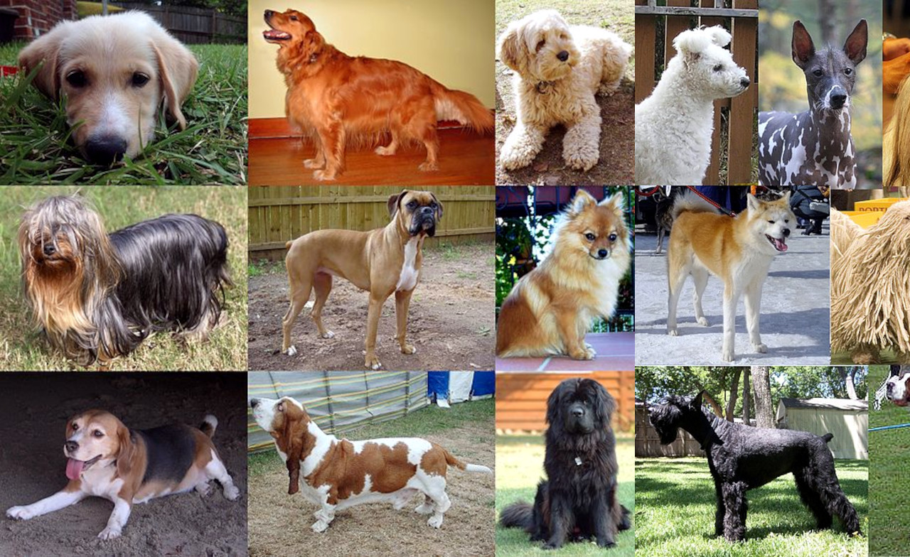

# A Journey into Dog Breed Classification with Deep Learning

When I first embarked on my [Udemy Data Scientist Nanodegree](https://www.udacity.com/enrollment/nd025) Program, I never anticipated that it would lead me to create an algorithm capable of recognizing dog breeds from images. Coming from a background in writing a thesis on _Particle Imaging and Tracking in Branched Electrochemical Systems_, this project reconnected me with the fascinating field of image processing.

## The Technical Challenge

Classifying dog breeds is a complex task due to several factors:

- Some breeds look incredibly similar
- Color variations within a breed can be dramatic
- Random guessing would yield less than 1% accuracy

### The Technological Toolkit

To tackle this challenge, I assembled a robust tech stack:

- **Convolutional Neural Networks (CNNs)**
- **Transfer Learning**
- **Pre-trained ResNet50 model**
- **OpenCV for image processing**

## Project Highlights

### What the Algorithm Does

My system goes beyond a simple breed classifier. The detection and recognition engine can:

- Detect if an image contains a dog or a human
- Predict the specific dog breed with impressive accuracy
- Handle complex visual variations

### Key Technical Achievements

- **Accuracy**: 82.3% breed classification accuracy
- **Flexibility**: Works with various image inputs
- **Innovation**: Leverages cutting-edge deep learning techniques

## Behind the Scenes: How It Works

1. **Image Preprocessing**: Cleaning and preparing dog images for analysis
2. **Feature Extraction**: Utilizing ResNet50's pre-trained model
3. **Classification**: Identifying specific dog breeds
4. **Human Detection**: Employing Haar cascade classifiers

## Challenges and Learning Moments

Some interesting challenges I encountered include:

- Handling images with ambiguous subjects
- Dealing with limited training data
- Managing variations within dog breeds

## Future Improvements

While the current version is exciting, I'm already planning enhancements:

- Implementing full-body human detection
- Expanding training data diversity
- Refining the classification algorithm

Transitioning from my electrochemical imaging background to dog breed recognition has been an incredible learning experience. I hope it inspires others on their data science journeys.

## Technical Specs at a Glance

- **Programming Language**: Python
- **Key Libraries**: TensorFlow, Keras, OpenCV
- **Model**: ResNet50 with Transfer Learning
- **Classification Accuracy**: 82.3%

## LICENSE

Sample Images from [Wikimedia Commons](https://commons.wikimedia.org/). Creative Commons CC0 License.

Attribution 4.0 International - CC BY 4.0 <https://creativecommons.org/licenses/by/4.0/>

<a property="dct:title" rel="cc:attributionURL" href="https://github.com/anibalsanchez/a-journey-into-dog-breed-classification-with-deep-learning">A Journey into Dog Breed Classification with Deep Learning</a> by <a rel="cc:attributionURL dct:creator" property="cc:attributionName" href="https://www.linkedin.com/in/anibalsanchez/">Anibal H. Sanchez Perez</a> is licensed under <a href="https://creativecommons.org/licenses/by/4.0/?ref=chooser-v1" target="_blank" rel="license noopener noreferrer" style="display:inline-block;">Creative Commons Attribution 4.0 International</a>

